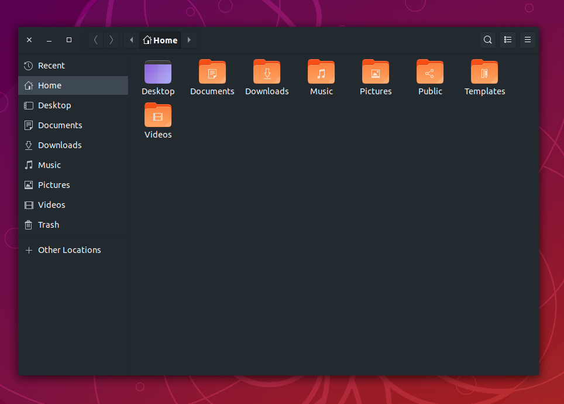

# Numix Tailwind GTK Theme

A fork of the popular [Numix](https://github.com/numixproject/numix-gtk-theme) GTK Theme that uses
the [default color palette](https://tailwindcss.com/docs/colors/) of [tailwindcss](https://tailwindcss.com)



## Why?

The Tailwind color palette is very well thought out and well rounded - the numix gtk theme is a very basic
non-flashy theme that does not exist in a (maintained) dark GTK2 variant anymore.
Thus, numix-tailwind was born.


## Build It

First, you need to compile the theme using the [Sass](http://sass-lang.com/) compiler.

To install Sass, install Ruby and the gem command using your distribution's package manager. Then install `sass` with the `gem` command,

`gem install sass` (not needed for Ubuntu/Debian)

You'll also need the ```glib-compile-schemas``` and  ```gdk-pixbuf-pixdata``` commands in your path to generate the gresource binary. Install them using your distribution's package manager.

|Distro|Commands|
|:----:|:----:|
|![arch][arch] &nbsp;![antergos][antergos]|`sudo pacman -S glib2 gdk-pixbuf2`|
|![opensuse][opensuse]|`sudo zypper install glib2-devel gdk-pixbuf-devel`|
|![fedora][fedora]|`sudo dnf install glib2-devel gdk-pixbuf2-devel`|
|![debian][debian] &nbsp;![ubuntu][ubuntu]|`sudo apt-get install ruby-sass libglib2.0-dev libgdk-pixbuf2.0-dev libxml2-utils`|

After installing all the dependencies, change to the cloned directory and, run the following in Terminal,

#### For developers
If you want to hack on the theme, make sure you have the `inotifywait` command available, which is used for watching and automatically building the files.

To start watching for changes, run the following,

```sh
make watch
```
